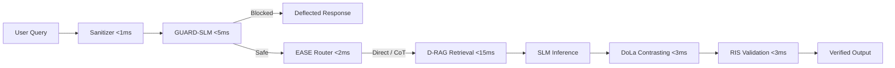

# Ravel: Enterprise Zero-Trust Security Gateway for LLM Agents

[](https://opensource.org/licenses/MIT)
[](https://github.com/Syf-Almjd/ravel_llm_security/actions/workflows/ci.yml)
[](https://www.python.org/downloads/)
[](https://nuxt.com/)
[](https://github.com/astral-sh/ruff)

> **Protect agents, tools, memory, RAG, and execution workflows — without sacrificing Small Language Model (SLM) latency.**

Ravel is an enterprise-grade runtime security platform designed specifically to safeguard autonomous AI agents and Small Language Models (SLMs). Traditional AI guardrails rely on secondary LLMs (LLM-as-a-judge) that introduce 200–500ms of latency, wiping out the speed advantage of SLMs. 

Ravel solves this through **Selective Compute Defense-in-Depth**: an ultra-fast, multi-stage pipeline that applies sub-millisecond heuristics and calibrated machine learning classifiers, conditionally invoking deep reasoning (Chain-of-Thought) and contrastive layer decoding (DoLa) only when risk or query complexity demands it.

---

## 🛡️ Architecture & Pipeline Flow



### Defense-in-Depth Pipeline Layers

| Stage | Component | Technical Mechanism | Latency SLA |
|---|---|---|---|
| **1** | **Sanitizer** | Strips zero-width Unicode characters, normalizes Cyrillic/Greek homoglyphs, defuses hidden markdown payloads. | `< 1 ms` |
| **2** | **GUARD-SLM** | Calibrated Linear Support Vector Classifier (`LinearSVC` + `CalibratedClassifierCV`) on TF-IDF features with exact keyword blocklisting. | `< 5 ms` |
| **3** | **EASE Router** | Entropy-Aware Selective Execution routing benign/simple queries directly and complex reasoning queries to Chain-of-Thought (CoT). | `< 2 ms` |
| **4** | **D-RAG** | Distilled Retrieval-Augmented Generation with semantic relevance thresholding against ChromaDB vector embeddings. | `< 15 ms` |
| **5** | **Inference Engine** | Low-latency local or remote inference loop (Ollama, vLLM, or custom endpoint). | Model dependent |
| **6** | **DoLa Decoder** | Decoding by Contrasting Layers — contrasts mature vs. intermediate layers to reduce factual hallucinations. | `< 3 ms` |
| **7** | **RIS Evaluator** | Reasoning Integrity Score computing semantic entailment, constraint fulfillment, and factuality (0.00–1.00). | `< 3 ms` |

---

## ✨ Enterprise Features

- **Long-Term Agent Memory Bank**: Semantic vector memory with intra-batch deduplication, importance weighting (0.0–1.0), and portable Markdown export/import.
- **Enterprise RBAC & Auth**: Secure JWT-based authentication with cryptographic JTI session tracking, user roles (`admin` vs. `user`), and zero-trust instant session revocation.
- **Dynamic Policy Hot-Reloading**: YAML-driven security policies (`policies/default.yaml`) hot-reloaded at runtime without container restarts.
- **Real-Time Telemetry & Observability**: Integrated Prometheus metrics endpoint (`/metrics`) and live forensic transaction inspector tracking end-to-end RTT, TTFT, and threat deflection stats.
- **Modern Nuxt 3 SPA**: Reactive glassmorphism dashboard with threat analytics maps, dynamic canvas latency charts, persona templates, and security logs.

---

## 🚀 Quick Start

### Option A: Docker Compose (Recommended)

Run the entire stack (Ravel Gateway + Ollama) with a single command:

```bash
docker compose up -d --build
```

Access the web interface at **`http://localhost:8000`**.

Pull an SLM model into the Ollama container:
```bash
docker compose exec ollama ollama pull gemma3:1b
```

---

### Option B: Local Development Setup

#### 1. Prerequisites
- **Python 3.11+**
- **Node.js 20+** and **npm**
- **Ollama** ([Download](https://ollama.com/download))

#### 2. Backend Setup
```bash
# Clone the repository
git clone https://github.com/Syf-Almjd/ravel_llm_security.git
cd ravel_llm_security

# Create and activate virtual environment
python3.11 -m venv .venv
source .venv/bin/activate

# Install dependencies
pip install -r backend/requirements.txt
pip install pytest pytest-asyncio httpx ruff

# Train Guard Classifier & Seed Vector DB
python backend/scripts/train_guard.py
python backend/scripts/seed_chromadb.py
python backend/scripts/generate_templates.py

# Launch FastAPI server
cd backend
uvicorn app:app --reload --port 8000
```

#### 3. Frontend Setup
```bash
cd frontend
npm install

# For local development with hot-reload
npm run dev -- --port 3000

# Or compile static production assets for FastAPI
npm run generate
```

---

## 🧪 Testing & Code Quality

Ravel maintains 100% passing automated test coverage across authentication, memory persistence, pipeline components, and REST endpoints:

```bash
# Run backend test suite (37 tests with isolated SQLite fixtures)
pytest backend/tests/ -v

# Run Python linting and code style verification
ruff check backend/

# Verify Nuxt static generation
cd frontend && npm run generate
```

---

## 📡 REST API Reference

All requests accept `Authorization: Bearer <jwt_token>` for authenticated routes.

### Authentication & Users
| Method | Endpoint | Description |
|---|---|---|
| `POST` | `/api/auth/register` | Register a new user (first user automatically promoted to admin) |
| `POST` | `/api/auth/login` | Authenticate user credentials and receive JWT bearer token |
| `GET` | `/api/auth/me` | Fetch active user profile and role |
| `POST` | `/api/auth/logout` | Revoke active session token |

### Security Gateway & Pipeline
| Method | Endpoint | Description |
|---|---|---|
| `POST` | `/api/chat` | Main shielded conversation route with stage flags |
| `POST` | `/api/query` | Single-turn prompt submission through the security pipeline |
| `POST` | `/api/query/raw` | Bypass security pipeline for red-team benchmarking |
| `GET` | `/api/health` | Healthcheck and Ollama connectivity status |
| `GET` | `/api/telemetry` | Recent transaction traces and latency metrics |
| `GET` | `/api/requests/history` | Historical audit logs of processed queries |
| `POST` | `/api/reset-metrics` | Reset telemetry counters and transaction logs |

### Agent Memory Bank
| Method | Endpoint | Description |
|---|---|---|
| `GET` | `/api/memories` | Retrieve stored memories filtered by persona template |
| `POST` | `/api/memories` | Manually store an agent memory with importance score |
| `PUT` | `/api/memories/{id}` | Update memory content or importance |
| `DELETE` | `/api/memories/{id}` | Delete memory from the vector index |
| `GET` | `/api/memories/export` | Export memory bank to Markdown |
| `POST` | `/api/memories/import` | Import memory bank from Markdown |

### Administration & Policies
| Method | Endpoint | Description |
|---|---|---|
| `GET` | `/api/admin/stats` | System-wide aggregates (users, sessions, deflections) |
| `GET` | `/api/admin/users` | List all registered users |
| `GET` | `/api/admin/threats` | Global blocked threat audit trail |
| `GET` | `/api/policy` | Read active YAML security policy |
| `POST` | `/api/policy` | Hot-reload YAML security policy |
| `GET` | `/metrics` | Prometheus telemetry metrics |

---

## 🔒 Security & Vulnerability Reporting

Please review our [Security Policy](SECURITY.md) for details on supported versions and responsible disclosure. To report a security vulnerability, please submit a private advisory via GitHub or contact `security@ravel.dev`.

---

## 🤝 Contributing

We welcome contributions from the AI security, NLP, and open-source developer communities! Please see [CONTRIBUTING.md](CONTRIBUTING.md) for setup instructions and code guidelines, and review our [Code of Conduct](CODE_OF_CONDUCT.md).

---

## 📄 License

Ravel is open-source software licensed under the [MIT License](LICENSE).
